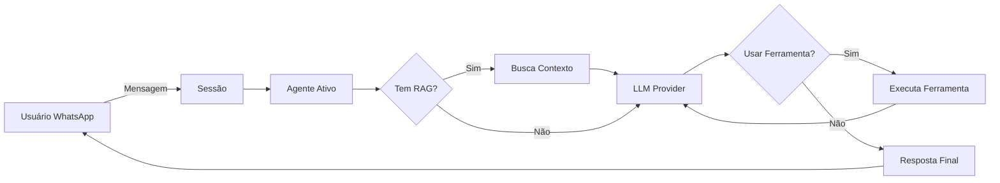

# 🚀 Fluxi - Assistente WhatsApp Inteligente

<div align="center">

**Plataforma completa para criar assistentes WhatsApp com IA, ferramentas customizadas e base de conhecimento**

[](https://fastapi.tiangolo.com/)
[](https://www.python.org/)
[](https://www.sqlalchemy.org/)
[](LICENSE)

</div>

---

## 📖 Sobre o Projeto

**Fluxi** é uma plataforma opensource para criar e gerenciar assistentes inteligentes no WhatsApp. Com ele, você pode:

✅ Criar múltiplos agentes com personalidades únicas  
✅ Configurar ferramentas customizadas (APIs, funções, integrações)  
✅ Treinar bases de conhecimento (RAG) com seus documentos  
✅ Integrar múltiplos provedores LLM (OpenRouter, OpenAI, Anthropic, etc.)  
✅ Conectar ferramentas externas via MCP (Model Context Protocol)  
✅ Gerenciar múltiplas sessões WhatsApp  
✅ Monitorar métricas e performance  

---

## 🎯 Casos de Uso

- 🏢 **Atendimento ao Cliente** - Automatize suporte 24/7
- 💼 **Vendas** - Qualifique leads e agende reuniões
- 📚 **Suporte Técnico** - Responda dúvidas com base de conhecimento
- 🎓 **Educação** - Assistentes educacionais personalizados
- 🏥 **Agendamentos** - Marque consultas e envie lembretes
- 📊 **Consultas de Dados** - Busque informações em sistemas internos

---

## ⚡ Quick Start

### Opção 1: Docker (Recomendado)

#### 1. Clone o repositório
```bash
git clone https://github.com/jjhoow/fluxi.git
cd fluxi
```

#### 2. Configure o ambiente
```bash
# Copie o arquivo de exemplo
cp config.example.env .env

# Edite as configurações (opcional)
nano .env
```

**Arquivo .env básico:**
```bash
# Configuração do Banco de Dados
DATABASE_URL=sqlite:///./fluxi.db

# Configuração do Servidor
HOST=0.0.0.0
PORT=8001
DEBUG=True

# Diretório de Upload de Imagens
UPLOAD_DIR=./uploads
```

#### 3. Execute com Docker
```bash
# Método 1: Usando docker-compose
docker-compose up -d

# Método 2: Usando o script helper
chmod +x docker-run.sh
./docker-run.sh setup    # Configuração inicial
./docker-run.sh start    # Inicia o Fluxi
```

#### 4. Acesse a interface
Abra seu navegador em `http://localhost:8001`

### Opção 2: Instalação Local

#### 1. Clone o repositório
```bash
git clone https://github.com/jjhoow/fluxi.git
cd fluxi
```

#### 2. Instale as dependências
```bash
pip install -r requirements.txt
```

#### 3. Execute o projeto
```bash
python main.py
```

#### 4. Acesse a interface
Abra seu navegador em `http://localhost:8001`

## ⚙️ Configuração Inicial

### 1. Configurar Provedor LLM

#### Opção A: OpenRouter (Mais Fácil)
1. Acesse `http://localhost:8001/configuracoes`
2. Adicione sua chave OpenRouter
3. Teste a conexão

#### Opção B: Provedor Local
1. Acesse `http://localhost:8001/llm-providers`
2. Clique em "Novo Provedor"
3. Configure:
   - **Tipo**: LM Studio, llama.cpp ou Ollama
   - **URL**: `http://localhost:11434` (Ollama) ou `http://localhost:1234` (LM Studio)
   - **Modelo**: Seu modelo preferido
4. Teste a conexão

### 2. Criar Sessão WhatsApp

1. Acesse `http://localhost:8001/sessoes`
2. Clique em "Nova Sessão"
3. Preencha:
   - **Nome**: Nome da sessão
   - **Descrição**: Descrição opcional
4. Clique em "Criar"
5. Clique em "Conectar" na sessão criada
6. Escaneie o QR Code com seu WhatsApp

### 3. Criar Agente

1. Acesse `http://localhost:8001/agentes/sessao/{id-da-sessao}`
2. Clique em "Novo Agente"
3. Preencha os campos:
   - **Nome**: Nome do agente
   - **Papel**: Ex: "Assistente de Vendas"
   - **Objetivo**: Ex: "Ajudar clientes com produtos"
   - **Políticas**: Ex: "Sempre ser educado e profissional"
   - **Tarefa**: Ex: "Responder dúvidas sobre produtos"
   - **Objetivo Explícito**: Ex: "Aumentar vendas"
   - **Público-alvo**: Ex: "Clientes interessados em produtos"
   - **Restrições**: Ex: "Não fazer promessas que não posso cumprir"
4. Selecione o provedor LLM configurado
5. Clique em "Criar"

### 4. Testar o Sistema

1. Envie uma mensagem para o número conectado
2. O agente deve responder automaticamente
3. Verifique as métricas em `http://localhost:8001/metricas`

## 🐳 Comandos Docker

### Comandos Básicos
```bash
# Iniciar Fluxi
./docker-run.sh start

# Parar Fluxi
./docker-run.sh stop

# Reiniciar Fluxi
./docker-run.sh restart

# Ver logs
./docker-run.sh logs

# Abrir shell no container
./docker-run.sh shell
```

### Comandos Avançados
```bash
# Configurar porta personalizada
./docker-run.sh start -p 8080

# Configurar caminho do banco
./docker-run.sh start -d /custom/path/fluxi.db

# Configurar todos os caminhos
./docker-run.sh start -p 8080 -d /data/fluxi.db -u /data/uploads -s /data/sessoes -r /data/rags

# Rebuild da imagem
./docker-run.sh build

# Limpeza completa
./docker-run.sh clean
```

### Variáveis de Ambiente
```bash
# .env
# Configuração do Banco de Dados
DATABASE_URL=sqlite:///./fluxi.db

# Configuração do Servidor
HOST=0.0.0.0
PORT=8001
DEBUG=True

# Diretório de Upload de Imagens
UPLOAD_DIR=./uploads

```
   - Escaneie o QR Code com WhatsApp

3. **Crie um Agente**
   - Dentro da sessão, crie um agente
   - Configure seu system prompt (papel, objetivo, políticas)
   - Adicione ferramentas (opcional)

4. **Envie uma mensagem!**
   - Envie mensagem no WhatsApp vinculado
   - O agente responderá automaticamente

---

## 📂 Arquitetura do Projeto

```
fluxi/
├── agente/                    # Módulo de agentes inteligentes
├── config/                    # Configurações do sistema
├── ferramenta/                # Ferramentas executáveis
├── llm_providers/             # Integrações com provedores LLM
├── mcp_client/                # Model Context Protocol
├── mensagem/                  # Mensagens WhatsApp
├── metrica/                   # Métricas e monitoramento
├── rag/                       # Sistema RAG (bases de conhecimento)
├── sessao/                    # Sessões WhatsApp
├── templates/                 # Templates HTML (Jinja2)
├── uploads/                   # Arquivos enviados
├── rags/                      # Bases de conhecimento ChromaDB
├── database.py                # Configuração SQLAlchemy
├── main.py                    # Aplicação FastAPI
├── requirements.txt           # Dependências Python
└── README.md                  # Este arquivo
```

---

## 📚 Documentação dos Módulos

### 🤖 [Agente](agente/README.md)
Gerenciamento de agentes inteligentes com system prompts personalizados, ferramentas e bases de conhecimento.

**Principais funcionalidades:**
- Criação de agentes com personalidades únicas
- System prompt estruturado (papel, objetivo, políticas, restrições)
- Até 20 ferramentas ativas por agente
- Integração com RAG para busca em documentos
- Suporte a clientes MCP
- Loop agentic para execução de múltiplas ferramentas
- Configurações LLM específicas por agente

**[📖 Ver documentação completa →](agente/README.md)**

---

### ⚙️ [Config](config/README.md)
Centro de configurações do sistema com gerenciamento de chaves de API, parâmetros LLM e preferências globais.

**Principais funcionalidades:**
- Sistema chave-valor tipado (string, int, float, bool, json)
- Categorização de configurações (geral, openrouter, agente, llm, rag)
- Configurações padrão para novos agentes
- Teste de conexão com OpenRouter
- Gerenciamento de provedores LLM
- Configurações RAG por provider (OpenAI, Cohere, HuggingFace, Google)
- Interface web para edição
- Conversão automática de tipos

**[📖 Ver documentação completa →](config/README.md)**

---

### 🔧 [Ferramenta](ferramenta/README.md)
Sistema de function calling com wizard visual para criar ferramentas customizadas que integram APIs e executam código.

**Principais funcionalidades:**
- Wizard visual de 7 etapas para criação sem código
- Ferramentas WEB (requisições HTTP) e CODE (Python)
- Parser de CURL completo com suporte a autenticação
- Variáveis dinâmicas `{var.TOKEN}`, `{campo}`, `{env.KEY}`
- Output flexível (LLM, User, Both) com canais (texto, imagem, áudio, vídeo)
- Encadeamento de ferramentas (workflows)
- Mapeamento de resposta (JsonPath)
- Variáveis por ferramenta (API keys, secrets)
- Ferramentas padrão (data/hora, calculadora)

**[📖 Ver documentação completa →](ferramenta/README.md)**

---

### 🧠 [LLM Providers](llm_providers/README.md)
Gerenciamento de provedores LLM locais e externos com suporte a múltiplos modelos e fallback automático.

**Principais funcionalidades:**
- Suporte a LM Studio, llama.cpp e Ollama
- APIs OpenAI-compatíveis
- Teste de conexão e descoberta de modelos
- Cache de modelos disponíveis
- Estatísticas de uso e performance
- Fallback automático para OpenRouter
- Interface web para gerenciamento
- Configuração de provedores personalizados

**[📖 Ver documentação completa →](llm_providers/README.md)**

---

### 🔌 [MCP Client](mcp_client/README.md)
Implementação completa do Model Context Protocol para conectar ferramentas externas (GitHub, filesystem, databases).

**Principais funcionalidades:**
- Suporte a STDIO, SSE e Streamable HTTP
- Biblioteca de presets prontos (GitHub, Jina AI, Brave Search, PostgreSQL, etc.)
- Instalação one-click via JSON
- Sincronização automática de ferramentas
- Integração transparente com agentes
- Gerenciamento de conexões e reconexão automática
- Compatível com Claude Desktop config

**[📖 Ver documentação completa →](mcp_client/README.md)**

---

### 💬 [Mensagem](mensagem/README.md)
Armazenamento e gerenciamento de mensagens WhatsApp com histórico, contexto e métricas de processamento.

**Principais funcionalidades:**
- Histórico completo de conversas
- Suporte a texto, imagens, áudios, vídeos, documentos
- Contexto de conversação por cliente
- Métricas de processamento (tokens, tempo, ferramentas)
- Registro de respostas do agente
- Status de processamento e resposta

**[📖 Ver documentação completa →](mensagem/README.md)**

---

### 📊 [Métrica](metrica/README.md)
Sistema de analytics e monitoramento com estatísticas de uso, performance e consumo.

**Principais funcionalidades:**
- Métricas gerais do sistema
- Performance por sessão
- Estatísticas por período
- Taxa de resposta e sucesso
- Consumo de tokens (input/output)
- Tempo médio de processamento
- Clientes únicos atendidos
- Gráficos e visualizações

**[📖 Ver documentação completa →](metrica/README.md)**

---

### 📚 [RAG](rag/README.md)
Sistema RAG (Retrieval-Augmented Generation) com ChromaDB e embeddings para bases de conhecimento.

**Principais funcionalidades:**
- Upload de documentos (PDF, TXT, DOC, DOCX)
- Adição de texto direto
- Suporte a múltiplos providers (OpenAI, Cohere, HuggingFace, Google)
- Chunking inteligente com overlap
- Busca semântica por similaridade
- Integração transparente com agentes
- Métricas de uso e performance
- Gerenciamento de chunks

**[📖 Ver documentação completa →](rag/README.md)**

---

### 📱 [Sessão](sessao/README.md)
Gerenciamento de conexões WhatsApp usando Neonize com suporte a QR Code e múltiplos agentes.

**Principais funcionalidades:**
- Conexão via QR Code ou Pair Code
- Múltiplas contas WhatsApp simultâneas
- Auto-responder inteligente
- Alternância entre agentes
- Envio de mensagens (texto, imagens, áudios, etc.)
- Gerenciamento de status (conectado/desconectado)
- Reconexão automática
- Histórico de conversas

**[📖 Ver documentação completa →](sessao/README.md)**

---

---

## 🛠️ Tecnologias Utilizadas

### Backend
- **FastAPI** - Framework web moderno e rápido
- **SQLAlchemy** - ORM para banco de dados
- **Pydantic** - Validação de dados
- **httpx** - Cliente HTTP assíncrono

### LLM & IA
- **OpenRouter** - Gateway para múltiplos LLMs
- **LangChain** - Orquestração de LLMs
- **ChromaDB** - Banco vetorial para RAG
- **Embedchain** - Framework RAG

### WhatsApp
- **Neonize** - Biblioteca Python para WhatsApp Web

### Frontend
- **Jinja2** - Templates HTML com herança
- **Bootstrap 5** - Framework CSS responsivo
- **HTMX** - Interatividade sem JavaScript complexo
- **Templates modulares** - Componentes reutilizáveis
- **Interface responsiva** - Mobile-first design

### Banco de Dados
- **SQLite** - Banco principal (padrão)
- **Suporte a PostgreSQL/MySQL** - Para produção

---

## 🔄 Fluxo de Funcionamento



1. **Mensagem recebida** via WhatsApp
2. **Sessão** identifica o agente ativo
3. **Agente** constrói system prompt e contexto
4. **RAG** busca informações relevantes (se configurado)
5. **LLM Provider** processa com modelo escolhido
6. **Ferramentas** são executadas se necessário (loop agentic)
7. **Resposta** enviada ao usuário

---

## 🎨 Recursos Principais

### 1. Interface Web Moderna
- **Dashboard responsivo** com métricas em tempo real
- **Wizard visual** para criação de ferramentas (7 etapas)
- **Templates modulares** com herança Jinja2
- **Componentes reutilizáveis** (forms, cards, modals)
- **Navegação intuitiva** entre módulos
- **Design mobile-first** com Bootstrap 5

### 2. Múltiplos Agentes por Sessão
Crie diferentes agentes especializados (vendas, suporte, etc.) e alterne entre eles na mesma sessão WhatsApp.

### 3. System Prompt Estruturado
Configure agentes com 7 campos específicos:
- Papel
- Objetivo
- Políticas
- Tarefa
- Objetivo Explícito
- Público-alvo
- Restrições

### 4. Ferramentas Customizadas
Crie ferramentas via wizard visual:
- Requisições HTTP (GET, POST, PUT, DELETE)
- Autenticação (Bearer, API Key, Basic Auth)
- Variáveis dinâmicas (sessão, cliente, agente)
- Transformação de dados (JsonPath)
- Output flexível (LLM, User, Both)

### 5. Base de Conhecimento (RAG)
Treine agentes com seus documentos:
- Upload de PDFs, TXTs, DOCs
- Processamento automático com embeddings
- Busca semântica em tempo real
- Métricas de uso

### 6. Múltiplos Provedores LLM
Integre com diversos provedores:
- OpenRouter (gateway para 200+ modelos)
- OpenAI (GPT-4, GPT-3.5)
- Anthropic (Claude)
- Google (Gemini)
- Suporte a fallback automático

### 7. Model Context Protocol (MCP)
Conecte ferramentas externas:
- GitHub
- Databases
- Filesystem
- APIs customizadas

### 8. Métricas e Monitoramento
Acompanhe performance:
- Mensagens processadas
- Tokens consumidos
- Tempo de resposta
- Ferramentas mais usadas
- Custo estimado

## 🎨 Interface Web

### Templates e Componentes

O Fluxi usa **Jinja2** com herança de templates para uma interface moderna e responsiva:

```
templates/
├── base.html                    # Template base com Bootstrap 5
├── index.html                   # Dashboard principal
├── agente/                      # Módulo de agentes
│   ├── lista.html              # Lista de agentes
│   ├── form.html               # Formulário de agente
│   ├── ferramentas.html        # Gerenciar ferramentas
│   └── detalhes.html           # Detalhes do agente
├── ferramenta/                  # Módulo de ferramentas
│   ├── lista.html              # Lista de ferramentas
│   ├── form.html               # Formulário de ferramenta
│   └── wizard/                 # Wizard de criação
│       ├── step1.html          # Definição básica
│       ├── step2.html           # Parâmetros
│       ├── step3.html           # Configuração
│       ├── step4.html           # Mapeamento
│       ├── step5.html           # Output
│       ├── step6.html           # Encadeamento
│       └── step7.html           # Variáveis
├── sessao/                      # Módulo de sessões
│   ├── lista.html              # Lista de sessões
│   ├── form.html               # Nova sessão
│   ├── conectar.html            # QR Code
│   └── detalhes.html            # Detalhes da sessão
├── rag/                         # Módulo RAG
│   ├── lista.html              # Lista de RAGs
│   ├── form.html               # Novo RAG
│   ├── treinar.html            # Upload de documentos
│   ├── chunks.html             # Gerenciar chunks
│   └── buscar.html             # Testar busca
├── mcp/                         # Módulo MCP
│   ├── presets.html            # Presets disponíveis
│   ├── clients.html            # Clientes MCP
│   └── tools.html               # Tools disponíveis
├── metrica/                     # Módulo de métricas
│   ├── geral.html              # Dashboard geral
│   ├── sessao.html             # Métricas por sessão
│   └── periodo.html             # Estatísticas por período
└── shared/                      # Componentes compartilhados
    └── erro.html                # Página de erro
```

### Características da Interface

- **🎨 Design Moderno**: Bootstrap 5 com tema personalizado
- **📱 Responsivo**: Mobile-first design
- **⚡ Interativo**: HTMX para atualizações sem reload
- **🧩 Modular**: Componentes reutilizáveis
- **📊 Dashboard**: Métricas em tempo real
- **🔧 Wizard Visual**: Criação de ferramentas em 7 etapas
- **📱 QR Code**: Conexão WhatsApp integrada
- **📈 Gráficos**: Visualizações de métricas
- **🔍 Busca**: Filtros e pesquisa em listas
- **⚙️ Configurações**: Interface amigável para settings

### Páginas Principais

| Página | URL | Descrição |
|--------|-----|-----------|
| **Dashboard** | `/` | Visão geral com métricas |
| **Sessões** | `/sessoes` | Gerenciar WhatsApp |
| **Agentes** | `/agentes/sessao/{id}` | Agentes da sessão |
| **Ferramentas** | `/ferramentas` | Lista de ferramentas |
| **Wizard** | `/ferramentas/wizard/step1` | Criar ferramenta |
| **RAG** | `/rag` | Bases de conhecimento |
| **MCP** | `/mcp/presets` | Presets MCP |
| **Métricas** | `/metricas` | Analytics |
| **Config** | `/configuracoes` | Settings |

---

## 🔐 Segurança

- ✅ Variáveis de ambiente para credenciais sensíveis
- ✅ Sanitização de inputs
- ✅ Rate limiting (em desenvolvimento)
- ✅ Autenticação de sessões WhatsApp
- ⚠️ **Importante**: Use HTTPS em produção
- ⚠️ **Importante**: Não compartilhe `fluxi.db` publicamente

---

## 📊 Configurações

### Variáveis de Ambiente

```bash
# Configuração do Banco de Dados
DATABASE_URL=sqlite:///./fluxi.db

# Configuração do Servidor
HOST=0.0.0.0
PORT=8001
DEBUG=True

# Diretório de Upload de Imagens
UPLOAD_DIR=./uploads

# LLM (configurável via interface web)
# OPENROUTER_API_KEY=sua-chave-openrouter
# OPENAI_API_KEY=sua-chave-openai
# ANTHROPIC_API_KEY=sua-chave-anthropic
```

### Configurações via Interface

Acesse `/config` para configurar:
- Chaves de API de provedores LLM
- Modelo padrão
- Temperatura, max_tokens, top_p
- System prompts padrão
- Configurações de RAG

---

## 🤝 Contribuindo

Contribuições são bem-vindas! Para contribuir:

1. Fork o projeto
2. Crie uma branch para sua feature (`git checkout -b feature/MinhaFeature`)
3. Commit suas mudanças (`git commit -m 'Adiciona MinhaFeature'`)
4. Push para a branch (`git push origin feature/MinhaFeature`)
5. Abra um Pull Request

### Diretrizes

- Documente novas funcionalidades
- Adicione testes quando possível
- Siga o padrão de código existente
- Atualize README.md se necessário

---

## 🐛 Reportar Bugs

Encontrou um bug? Abra uma [issue](https://github.com/jjhoow/fluxi/issues) com:
- Descrição do problema
- Passos para reproduzir
- Comportamento esperado vs atual
- Screenshots (se aplicável)
- Versão do Python e SO

---

## 📝 Roadmap

- [ ] Autenticação de usuários
- [ ] Suporte a múltiplos idiomas
- [ ] API REST completa
- [ ] Webhooks
- [ ] Integração com Telegram
- [ ] Dashboard de analytics avançado
- [ ] Exportação de conversas
- [ ] Templates de agentes prontos
- [ ] Marketplace de ferramentas

---

## 🎓 Aprendizado e Documentação

Este projeto foi completamente documentado com READMEs individuais para cada módulo:

- ✅ **[Agente](agente/README.md)** - Sistema de agentes inteligentes com system prompts
- ✅ **[Config](config/README.md)** - Centro de configurações do sistema
- ✅ **[Ferramenta](ferramenta/README.md)** - Function calling e wizard de ferramentas
- ✅ **[LLM Providers](llm_providers/README.md)** - Gerenciamento de provedores LLM
- ✅ **[MCP Client](mcp_client/README.md)** - Model Context Protocol para ferramentas externas
- ✅ **[Mensagem](mensagem/README.md)** - Gerenciamento de mensagens WhatsApp
- ✅ **[Métrica](metrica/README.md)** - Analytics e monitoramento

### Guias de Configuração
- 🔧 [Configuração OpenRouter](config/README.md#configuração-openrouter)
- 🔧 [Configuração Provedores Locais](llm_providers/README.md#configuração)
- 🔧 [Criação de Agentes](agente/README.md#exemplos-de-uso)
- 🔧 [Sistema de Ferramentas](ferramenta/README.md#exemplos-de-uso)
- 🔧 [Configuração RAG](rag/README.md#exemplos-de-uso)
- 🔧 [Integração MCP](mcp_client/README.md#exemplos-de-uso)
- ✅ **[RAG](rag/README.md)** - Bases de conhecimento com embeddings
- ✅ **[Sessão](sessao/README.md)** - Conexões WhatsApp

Cada módulo possui documentação detalhada com:
- Arquitetura e componentes
- Modelos de dados
- Fluxos de funcionamento
- Exemplos práticos
- Integrações
- Notas técnicas

## 📄 Licença

Este projeto está sob a licença MIT. Veja o arquivo [LICENSE](LICENSE) para mais detalhes.

---

## 💬 Comunidade

- 🐛 **Issues**: [GitHub Issues](https://github.com/jjhoow/fluxi/issues)
- 💡 **Discussões**: [GitHub Discussions](https://github.com/jjhoow/fluxi/discussions)

---

## 🙏 Agradecimentos

- [FastAPI](https://fastapi.tiangolo.com/) - Framework web
- [Neonize](https://github.com/krypton-byte/neonize) - WhatsApp client
- [LangChain](https://www.langchain.com/) - Orquestração LLM
- [ChromaDB](https://www.trychroma.com/) - Banco vetorial
- [OpenRouter](https://openrouter.ai/) - Gateway LLM

---

<div align="center">

**Desenvolvido com ❤️ para a comunidade opensource**

⭐ **Se este projeto foi útil, considere dar uma estrela!** ⭐

</div>

